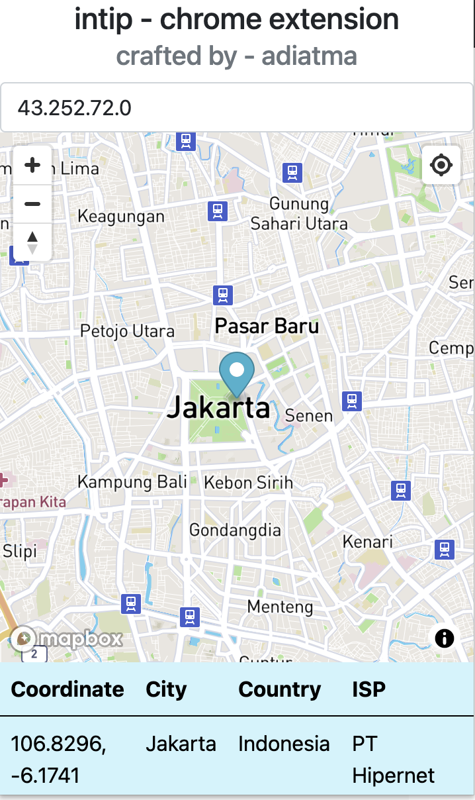

<div align="center">
  <h1>intip-chrome-extension</h1>
  <strong>Chrome extension with CRA + ReScript</strong>
  <br />
  <br />
  
</div>

## Getting Started

```bash
cp .env.example .env
yarn install
yarn re:watch # build rescript
yarn start # run project
```

## Notes

> to build in production, please follow steps at bellow.

```bash
chmod +x ./build.sh
yarn build
# then open chrome extensions in your browser, and click load unpacked
# upload folder in releases/<version>/* directory
```
